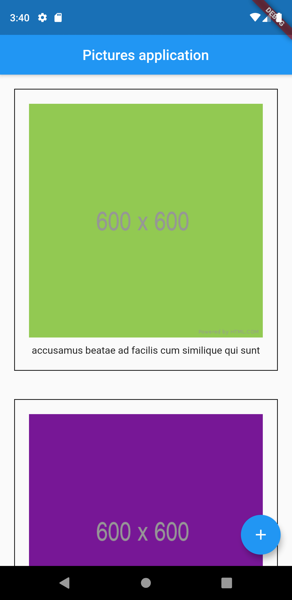

# Pictures Application
I have created a simple application in Flutter that displays a list of images and adds images to that list each time the button is clicked.

## Flutter Concepts
- Created a Stateless and Stateful Widget.
- Handling external API response and making the App work with async opeerations.
- Made use of the Scaffold, ListView, Image, Container, Padding widgets.
- Clear and readable code.

## Screenshots
